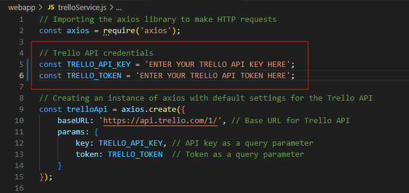

## Trello Integration Web App
A terminal-like web application built with Node.js and Vue.js that allows users to interact with Trello through commands.

## Prerequisites
Node.js (v14.x or higher)  
npm (v6.x or higher)  
### Personal Trello API Key and Token  
Make sure to change the following to your personal Trello API and token in the trelloService.js file, to link the app to your personal Trello account. (The API key and token must be within the quotation marks.)  

## Installation

### Clone the repository:
git clone https://github.com/your-username/Trello-Webapp.git  
cd webapp

## MAKE SURE TO RUN BOTH COMMAND PROMPT WINDOWS IN ADMINISTRATOR MODE!

### Backend Setup (In CMD):
cd webapp  
npm install

### Frontend Setup (In CMD):
cd webapp/public/terminal-frontend  
npm install

## Running the Application

### Start the Backend Server:
cd webapp  
node server.js  
The backend server will start on http://localhost:3000.

### Start the Frontend Development Server:
cd webapp/public/terminal-frontend  
npm run serve  
The frontend development server will start on http://localhost:8080.

## Usage
Open your web browser and go to http://localhost:8080.  
Use the terminal interface on the webpage to enter commands and interact with Trello.

## Commands
### List Trello Boards
Command: get boards  
Description: Fetch and display all Trello boards for the authenticated user.

### List Lists in a Board
Command: get lists <board_id>  
Description: Fetch and display all lists in a specified Trello board.

### Create a Card in a List
Command: create card <list_id> <card_name> <card_description>  
Description: Create a new card in the specified list with the given name and description.

### Move a Card
Command: move card <card_id> <target_list_id>  
Description: Move a specified card to another list.

### Delete a Card
Command: delete card <card_id>  
Description: Delete a specified card from Trello.

## Troubleshooting
404 Not Found Error: Ensure the backend server is running and the route URLs are correct.  
Invalid API Key or Token: Verify that your Trello API key and token are correct and have the necessary permissions.  
Network Issues: Ensure there are no network issues or firewalls blocking the requests.
Application Run Issues: Make sure you are running Command Prompt in administrator mode.